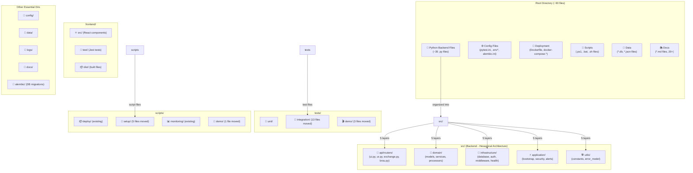

# 🏗️ SIFU Architecture Analysis - Current vs Expected

**Date:** October 16, 2025  
**Analysis:** Root file organization and project structure review  
**Purpose:** Understand current architecture and identify improvements

---

## 📊 Current Architecture (feature/architecture-compliance-audit-v1)



---

## ⚠️ ISSUE: Root Directory Still Has Too Many Files

### Problem Analysis

Your observation is **CORRECT**. The root directory has ~90 files, including:

#### 🐍 **Python Backend Files in ROOT (should be in src/):**
```
alerts.py
auth_middleware.py
auth_models.py
auth_routes.py
auth_service.py
bootstrap.py
brou_processor.py
circuit_breaker.py
config_validator.py
constants.py
correlation_middleware.py
dashboard.py
database.py
database_optimizer.py
error_model.py
excel_processor.py
exchange_utils.py
generate_security_docs.py
health_checks.py
https_middleware.py
init_brou_table.py
metrics.py
metrics_middleware.py
models.py
opentelemetry_setup.py
performance_budget.py
pydantic_models.py
rate_limit.py
secret_manager.py
secure_logging.py
security_monitor.py
security_utils.py
services.py
simple_totp.py
(and 1-2 more)
```

**Total: ~35 Python files in ROOT** ❌

These should be in `src/` but appear to be **SHIM FILES** for backward compatibility.

#### ⚙️ **Configuration Files in ROOT (~15 files):**
```
pytest.ini, alembic.ini, setup.cfg
.env, .env.*, .env.template (multiple)
nginx.conf, nginx.https.conf
.pre-commit-config.yaml
```

#### 🐳 **Deployment Files in ROOT (~8 files):**
```
Dockerfile
docker-compose.yml
docker-compose.simple.yml
docker-compose.gateway.yml
docker-compose.prod.yml
docker-compose.tunnel.yml
docker_update_tunnel_secret.ps1
```

#### 📜 **Scripts in ROOT (~5 files):**
```
start_server.ps1
start_server.bat
run_tunnel_backend.ps1
run_pipeline_tests.py
```

#### 💾 **Data Files in ROOT (~6 files):**
```
*.db files (3)
ur_refresh_resp.json
```

#### 📚 **Documentation in ROOT (~20+ files):**
```
README.md
LICENSE
SECURITY_CONFIG.md
NEXT_SESSION.md
TOTP_SETUP.md
ARCHITECTURE_IMPLEMENTATION_COMPLETE.md
CHANGELOG_*.md
PIPELINE_STATUS.md
(and more)
```

#### Other: `.github/`, `logs/`, `reports/`, `htmlcov/`, etc.

---

## 🎯 Architecture Comparison: CURRENT vs IDEAL

### Current State (This Branch)
```
sifu/                                  ← ROOT with ~90 files (CLUTTERED)
├── src/                               ← Hexagonal architecture (5 layers)
│   ├── api/
│   ├── domain/
│   ├── infrastructure/
│   ├── application/
│   └── utils/
├── frontend/                          ← React frontend (properly separated)
│   ├── src/
│   ├── test/
│   └── dist/
├── tests/                             ← Tests (QW#8)
│   ├── unit/
│   ├── integration/
│   └── demo/
├── scripts/                           ← Scripts (QW#8)
│   ├── deploy/
│   ├── setup/
│   ├── monitoring/
│   └── demo/
├── docs/                              ← Documentation
├── config/                            ← Config
├── data/                              ← Data
├── logs/                              ← Logs
├── alembic/                           ← DB migrations
│
├── *.py (35 files)                   ❌ SHIM FILES - Should be hidden
├── *.yml (6 files)                   ⚠️ Can stay OR move to config/
├── .env.* files                      ⚠️ Should be in config/env/
├── nginx.conf                        ⚠️ Should be in config/nginx/
├── Dockerfile                        ⚠️ Can stay (deployment entry point)
├── *.db files                        ⚠️ Should be in data/
├── *.md files (20+)                  ⚠️ Some should be in docs/
└── (other meta files)
```

### Ideal State (What We Should Aim For)
```
sifu/                                  ← ROOT with ~15 files (CLEAN)
├── src/                               ← Hexagonal (Production code)
│   ├── api/routers/
│   ├── domain/
│   ├── infrastructure/
│   ├── application/
│   └── utils/
├── frontend/                          ← React frontend
│   ├── src/
│   ├── test/
│   └── dist/
├── tests/                             ← Tests (organized by type)
│   ├── unit/
│   ├── integration/
│   └── demo/
├── scripts/                           ← Scripts (organized by purpose)
│   ├── deploy/
│   ├── setup/
│   ├── monitoring/
│   └── util/
├── config/                            ← All configuration
│   ├── env/                           (move .env files here)
│   ├── nginx/                         (move nginx.conf here)
│   ├── database/                      (alembic config)
│   └── ci/                            (GitHub Actions workflows)
├── docs/                              ← All documentation
│   ├── api/
│   ├── architecture/
│   ├── deployment/
│   └── guide/
├── data/                              ← Data & databases
│   ├── database/                      (*.db files)
│   ├── cache/
│   └── fixtures/
├── logs/                              ← Runtime logs
├── alembic/                           ← DB migrations
│
├── main.py                            ← Entry point (only essential Python files)
├── requirements*.txt                  ← Dependencies
├── Dockerfile                         ← Docker entry point
├── docker-compose.yml                 ← Default compose (or move to config/)
├── pytest.ini                         ← Test config (or move to config/)
├── .env.example                       ← Example env (or move to config/env/)
│
├── README.md                          ← Project overview
├── LICENSE                            ← License
└── package.json                       ← Frontend dependencies
```

---

## 🔍 Key Issues Identified

| Issue | Current | Ideal | Status |
|-------|---------|-------|--------|
| **Python files in root** | 35 shims | Hidden or minimal | ⚠️ QW#7 created shims |
| **Config files scattered** | All over | `config/` dir | ❌ Not done |
| **Frontend separated** | ✅ `frontend/` | ✅ `frontend/` | ✅ OK |
| **Backend organized** | ✅ `src/` (5 layers) | ✅ `src/` (5 layers) | ✅ OK |
| **Tests organized** | ✅ `tests/` (after QW#8) | ✅ `tests/` | ✅ OK |
| **Scripts organized** | ✅ `scripts/` (after QW#8) | ✅ `scripts/` | ✅ OK |
| **Databases centralized** | scattered | `data/` dir | ❌ Not done |
| **Docs centralized** | scattered | `docs/` dir | ⚠️ Partially done |

---

## 📈 Comparison: Master vs This Branch

### Master Branch (Before QW#7 & QW#8)
```
sifu/ (ROOT - CHAOS)
├── 35+ Python files scattered
├── 13+ test_*.py files scattered
├── 5+ setup/start scripts scattered
├── tests/                    (incomplete)
└── scripts/                  (incomplete)
```

### This Branch (After QW#7 & QW#8)
```
sifu/ (ROOT - BETTER, but still cluttered)
├── 35 Python files (shims)        ← Still in root (from QW#7)
├── src/                           ← NEW: Hexagonal architecture
│   ├── api/, domain/, infrastructure/, application/, utils/
├── tests/                         ← IMPROVED: Organized (QW#8)
│   ├── unit/, integration/, demo/
└── scripts/                       ← IMPROVED: Organized (QW#8)
    ├── deploy/, setup/, monitoring/, demo/
```

### Improvements Made
✅ QW#7: Organized `src/` into hexagonal (5 layers)  
✅ QW#8: Organized `tests/` by type (unit/integration/demo)  
✅ QW#8: Organized `scripts/` by purpose (deploy/setup/monitoring/demo)  
❌ Still needs: Centralize config, data, docs from root

---

## 🎯 Why the Shim Files Exist (QW#7 Decision)

During QW#7 (Hexagonal Architecture), the decision was made to:

1. **Move code to `src/` directory** (32 modules into 5 layers)
2. **Create shim files in root** for backward compatibility
3. **Reason:** Avoid breaking imports everywhere

```python
# Example shim file (constants.py in root)
# This allows: from constants import X
# To work while actual code is in: from src.utils.constants import X
```

**Trade-off:** Root became cluttered with 35 shim files instead of clean imports.

**Better approach would have been:**
```python
# Update imports everywhere to use src/
from src.utils.constants import X
from src.domain.services import UIService
```

---

## 💡 Recommendations

### Quick Win #9 (Proposed): Config & Data Organization

```
Phase 1: Consolidate Configuration
├── Move all .env* files → config/env/
├── Move nginx.conf → config/nginx/
├── Move pytest.ini → config/ or leave in root (test config standard)
├── Move alembic.ini → config/ or leave in root (migration standard)

Phase 2: Consolidate Data
├── Move *.db files → data/database/
├── Move *.json fixtures → data/fixtures/

Phase 3: Consolidate Documentation
├── Move strategically to docs/
├── Keep README.md, LICENSE in root

Phase 4: Clean up Root
├── Remove unnecessary .env files (keep .env.example)
├── Remove backup files from root
├── Final root should have ~15-20 files
```

### Quick Win #10 (Proposed): Remove Shim Files

```
Option A: Keep shims for backward compat (safer)
├── Leave 35 shim files but hide them somehow

Option B: Update all imports (cleaner)
├── Update codebase to import from src/
├── Remove all shim files
├── Root becomes ~15 files
```

---

## 📊 Summary Statistics

| Metric | Current | Ideal | Gap |
|--------|---------|-------|-----|
| **Files in root** | 90 | 15-20 | -70-75 files |
| **Python files in root** | 35 (shims) | 1 (main.py) | -34 files |
| **Config files scattered** | 15 | 1 (in config/) | -14 files |
| **Organized directories** | 4 (src, frontend, tests, scripts) | 6 (+ config, data) | +2 dirs |

---

## ✅ What's Working Well

✅ **Backend Organization** - Hexagonal architecture in `src/` (5 layers)  
✅ **Frontend Organization** - Separate `frontend/` directory with own structure  
✅ **Test Organization** - Tests in `tests/` by type  
✅ **Script Organization** - Scripts in `scripts/` by purpose  

## ❌ What Needs Improvement

❌ **Root Clutter** - 90 files instead of ~15  
❌ **Config Scattered** - `.env`, `nginx.conf`, etc. in root  
❌ **Data in Root** - `.db` files mixed with code  
❌ **Shim Files** - 35 backward-compatibility files in root  
❌ **Docs Scattered** - 20+ `.md` files in root  

---

## 🚀 Path Forward

### Option 1: Continue Current Path (Status Quo)
- Keep 90 files in root
- Keep shim files
- Easier to merge to master
- But: Poor professional appearance

### Option 2: Clean Up Root (Recommended)
- **QW#9:** Organize config/data/docs
- **QW#10:** Remove/hide shim files
- Result: ~15 files in root (professional)
- Effort: 1-2 hours

### Option 3: Major Refactor (Nuclear Option)
- Reorganize everything
- Update all imports
- Risk: Breaking changes
- Effort: 3-4 hours

---

**Recommendation:** Option 2 (QW#9 + QW#10) to achieve professional structure while minimizing risk.
