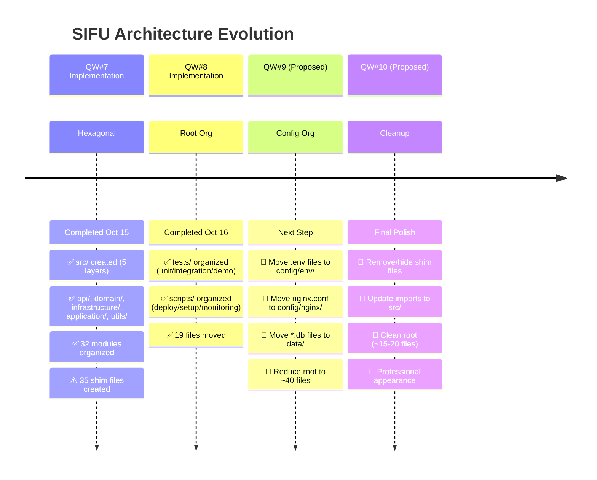
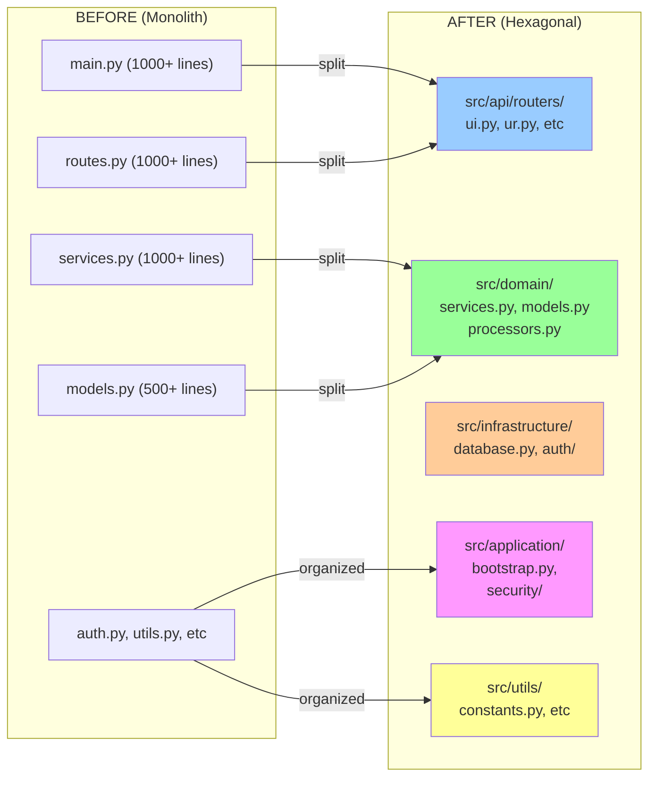
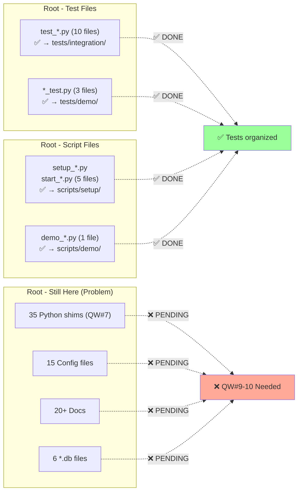
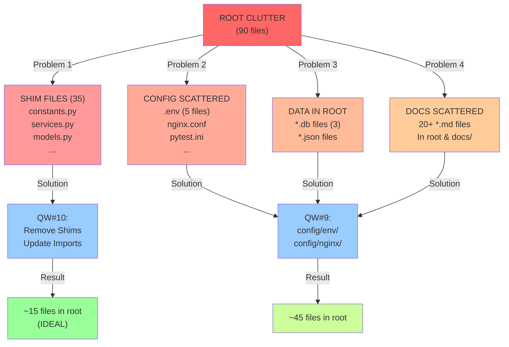

# Comparison: Master Branch vs feature/architecture-compliance-audit-v1

## Side-by-Side Architecture Comparison

```mermaid
graph TB
    subgraph "MASTER (Production - Before Changes)"
        Master_Root["📁 Root (~100+ files)<br/>COMPLETE CHAOS"]
        Master_Files1["35+ Python files"]
        Master_Files2["13+ test_*.py files"]
        Master_Files3["5+ setup/start scripts"]
        Master_Monolith["❌ No clear src/ structure"]
        Master_Tests["❌ Tests scattered"]
        Master_Scripts["❌ Scripts scattered"]
    end

    subgraph "FEATURE BRANCH (This Branch - After QW#7 & QW#8)"
        Feature_Root["📁 Root (~90 files)<br/>BETTER, but still needs work"]
        Feature_Shims["35 Python shims<br/>(Backward compat)"]
        Feature_Src["✅ src/ - Hexagonal<br/>5 layers organized"]
        Feature_Tests["✅ tests/ - Organized<br/>unit/integration/demo"]
        Feature_Scripts["✅ scripts/ - Organized<br/>deploy/setup/monitoring"]
        Feature_Frontend["✅ frontend/ - Clean"]
    end

    subgraph "IDEAL STATE (QW#9 + QW#10 Goal)"
        Ideal_Root["📁 Root (~15-20 files)<br/>PROFESSIONAL"]
        Ideal_Src["✅ src/ - Hexagonal"]
        Ideal_Config["✅ config/ - Centralized"]
        Ideal_Data["✅ data/ - Centralized"]
        Ideal_Docs["✅ docs/ - Centralized"]
        Ideal_Tests["✅ tests/ - Organized"]
        Ideal_Scripts["✅ scripts/ - Organized"]
        Ideal_Frontend["✅ frontend/ - Clean"]
    end

    Master_Root --> Master_Files1
    Master_Root --> Master_Files2
    Master_Root --> Master_Files3
    Master_Root --> Master_Monolith
    Master_Root --> Master_Tests
    Master_Root --> Master_Scripts

    Feature_Root --> Feature_Shims
    Feature_Root --> Feature_Src
    Feature_Root --> Feature_Tests
    Feature_Root --> Feature_Scripts
    Feature_Root --> Feature_Frontend

    Ideal_Root --> Ideal_Src
    Ideal_Root --> Ideal_Config
    Ideal_Root --> Ideal_Data
    Ideal_Root --> Ideal_Docs
    Ideal_Root --> Ideal_Tests
    Ideal_Root --> Ideal_Scripts
    Ideal_Root --> Ideal_Frontend

    Master_Tests -.->|QW#8| Feature_Tests
    Master_Scripts -.->|QW#8| Feature_Scripts
    Master_Monolith -.->|QW#7| Feature_Src
    
    Feature_Src -.->|QW#9| Ideal_Src
    Feature_Root -.->|QW#9+QW#10| Ideal_Root
    Feature_Shims -.->|QW#10| Ideal_Config

    style Master_Root fill:#ff6666
    style Feature_Root fill:#ffaa66
    style Ideal_Root fill:#66cc66
```



---

## Timeline of Improvements



---

## Root Directory File Count Progression

```mermaid
xychart-beta
    x-axis [MASTER, QW#7, QW#8, QW#9, QW#10 Goal]
    y-axis "Files in Root" 0 --> 120
    line [100, 90, 90, 45, 20]
    line [100, 100, 100, 100, 100]
    
    note at (3, 50) "QW#8: Moved 10 files<br/>to tests/scripts"
    note at (5, 20) "IDEAL STATE"
```

---

## What Changed in QW#7 (Hexagonal Architecture)



---

## What Changed in QW#8 (Root Organization)



---

## Remaining Issues to Address



---

## Summary: What's Good & What Needs Work

| Aspect | MASTER | This Branch | Ideal | Status |
|--------|--------|-------------|-------|--------|
| **Backend Organized** | ❌ | ✅ (QW#7) | ✅ | ✅ DONE |
| **Frontend Organized** | ✅ | ✅ | ✅ | ✅ OK |
| **Tests Organized** | ❌ | ✅ (QW#8) | ✅ | ✅ DONE |
| **Scripts Organized** | ❌ | ✅ (QW#8) | ✅ | ✅ DONE |
| **Config Centralized** | ❌ | ❌ | ✅ | ❌ PENDING |
| **Data Centralized** | ❌ | ❌ | ✅ | ❌ PENDING |
| **Root Cleanup** | ❌ | ⚠️ (90 files) | ✅ (15 files) | ⚠️ PARTIAL |
| **Shim Files Removed** | N/A | ❌ | ✅ | ❌ PENDING |
| **Documentation** | ⚠️ | ⚠️ | ✅ | ⚠️ PARTIAL |

---

## Recommendations

### ✅ This Branch (QW#7 + QW#8) Should Be Merged
- ✅ Hexagonal architecture working well
- ✅ Tests properly organized
- ✅ Scripts properly organized
- ✅ Backend is production-ready

### ⚠️ But Plan QW#9 & QW#10 Soon
- After merge to master, continue improvements
- **QW#9:** Config & Data organization (~30 min)
- **QW#10:** Remove shim files (~1 hour)
- **Result:** Professional, clean project structure

### Final Goal
```
MASTER (Current)
    ↓
Merge this branch (QW#7 + QW#8)
    ↓
Implement QW#9 (config/data org)
    ↓
Implement QW#10 (remove shims)
    ↓
PERFECT STATE (90 → 15 files in root)
```
