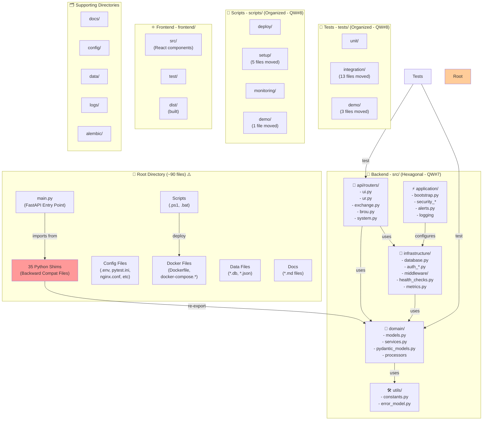
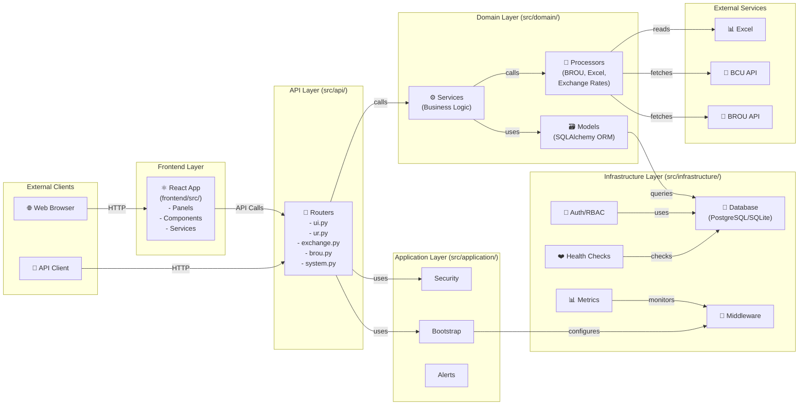
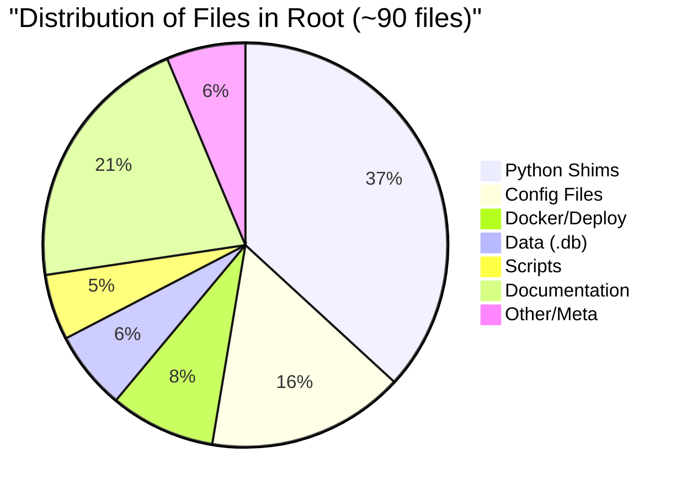
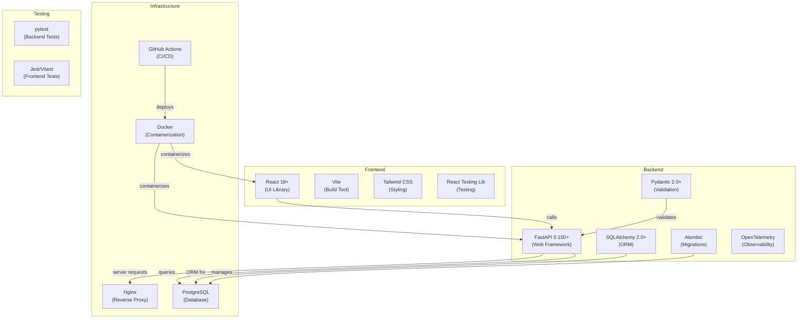
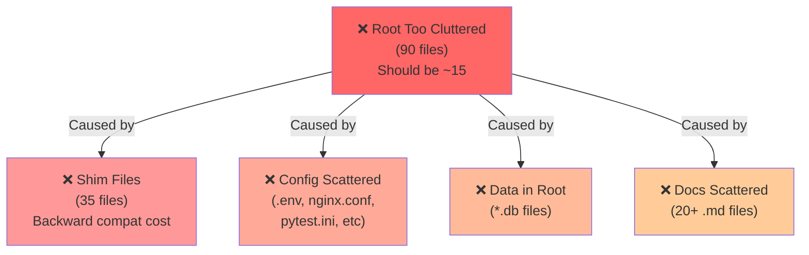

# Current Project Architecture - Visual Overview

## Current Structure (This Branch - feature/architecture-compliance-audit-v1)

---

## Architecture Layers - Details

---

## File Count Breakdown

---

## Technology Stack

---

## Current Issues

